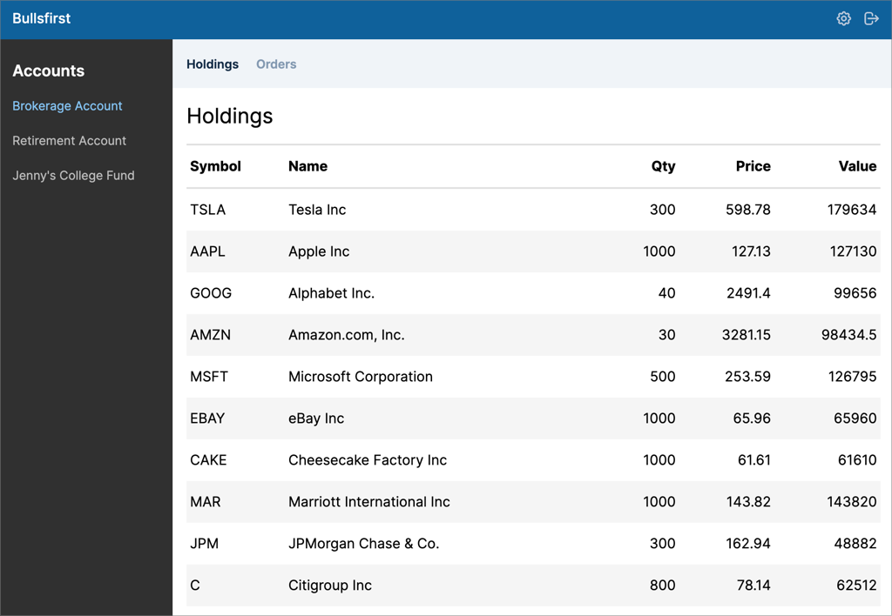

# Bullsfirst Tailwind

This is an example of using [Code Shaper](https://code-shaper.dev) to build a
React app with Tailwind CSS.

It consists of:

1. `packages/ui-lib-react`: a React component library that uses Tailwind CSS
2. `apps/bullsfirst-react`: a sample stock trading app that uses the above UI
   library



## Building Bullsfirst

### Development Build

```shell
# Run ci in the root directory to install dependencies
npm ci

# Run a full build to make sure libraries are available to the apps
npm run build

# Run the apps
npm run dev
```

Point your browser to http://localhost:3000/ to see the running app.

> Note: Do not run `npm install` or `npm ci` in any of the subdirectories. It
> will break the build. There should be only one `package-lock.json` file in the
> entire repo (at the root).

### Production Build

To build all packages and apps for production, run the following command:

```shell
npm ci
npm run build
```

### Clean Build

Removes all build artifacts and performs a clean build.

```shell
npm run clean
npm ci
npm run dev
```

For an "aggressive" clean build, add one more step as shown below. This will
build the lock file from scratch.

```shell
npm run clean
rm package-lock.json
npm install
npm run dev
```

## Running Storybook

```shell
# Install Storybook dependencies
cd storybbok
npm ci
cd ..

# Run Storybook
npm run storybook
```

## Running Unit Tests

```shell
npm test
```

## Running End-to-End Tests

```shell
npm run dev # starts a local server hosting the react app

# run cypress in a different shell
npm run cypress
```

## Code Formatting

```shell
npm run format
```
